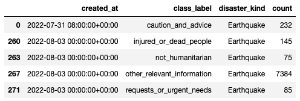
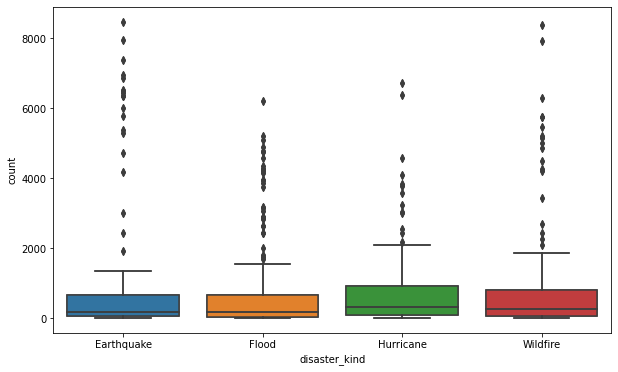
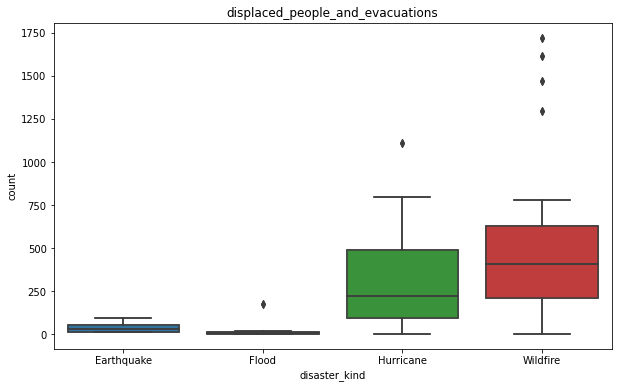
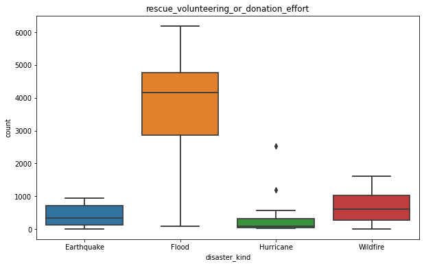
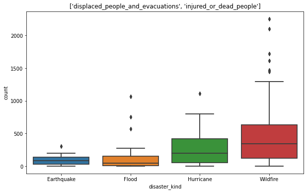
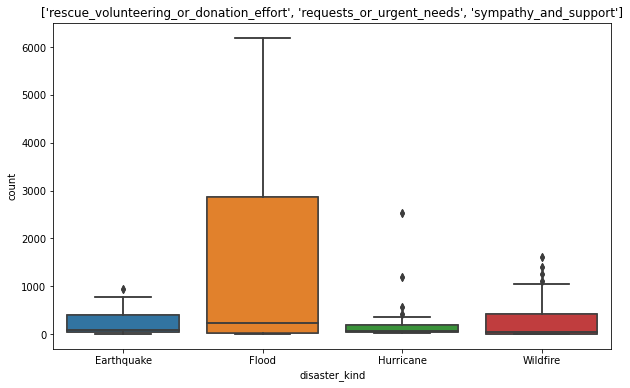
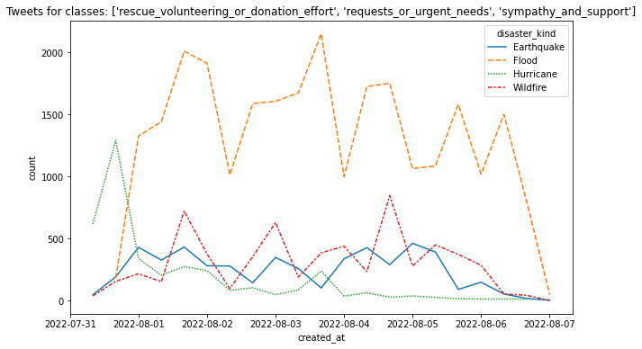

# Comparative analysis of tweet samples from the past week for different natural disasters

## Summary
The objective of training tweet classification models for the purpose of this project is to use them later
on a recent tweets, do an automated analysis and be able to answer questions like that:
- Is there an active disaster going on?
- What kind of disaster is going on - like wildfire, earthquake, flood, hurricane?
- What are the affected locations, are different locations affected together?
- For the active disasters, what categories are the tweets fit in - distress tweets, ask for donations etc.?
- What are the recommended actions in regard to the disaster?
- What is the disaster intensity over time, what are the peak days?
- Can we preview the tweets for a particular time and learn better what is going on?

The following elaboration explains how we can answer most of these questions.

For the purpose of this effort we have obtained and analyzed tweets for the week between July 31st, 2022
and August 7th, 2022.

## Obtaining sample tweets by querying the Twitter APIs
The first step in analyzing the most resent disaster tweets is obtaining them from Twitter. The solution we
settled on to achieve that is as follows:
- Using the keyword tokens obtained from the unsupervised topic exploration of the disaster sample, we
query the Twitter API for the past six days (this is max time allowed to go back) and for the tweets up to
certain count (default set to 2000) for every two-hour period. The queries we are using for the respective 
disasters are:

| Disaster |Twitter Query  |
| :------- | :-------------- |
| Wildfire | wildfire (donate OR (death toll) OR burn OR fire OR forest OR damage) |
| Earthquake | earthquake (pray OR victim OR donate OR rescue OR damage OR magnitude) |
| Flood | flood (relief OR water OR donate OR (death toll) OR rescue OR destroy) |
| Hurricane | hurricane (donate OR storm OR cyclone OR damage OR evacuation OR destroy) |

And the number of tweets retrieved is about 144,000 per disaster, or about 576,000 total. The details of
the retrieval process are in the recent_tweets_*.ipynb notebooks in the project output folder.

## Assigning a class label on the retrieved disaster tweets
The obtained tweets are labeled with one of following categories using the vectorizer and the classification
algorithm prepared in the upstream steps:
  - rescue_volunteering_or_donation_effort
  - other_relevant_information
  - requests_or_urgent_needs
  - injured_or_dead_people
  - infrastructure_and_utility_damage
  - sympathy_and_support
  - caution_and_advice
  - not_humanitarian
  - displaced_people_and_evacuations
  - missing_or_found_people
The completed dataset is ready for further analysis

## Determining the dominating disaster in a category
The first question we are trying to answer on the newly obtained dataset is find out if there is an
active disaster, and what kind it is. For that purpose, we group all the tweets per disaster type and 
class label, and find the count of the tweets for 8-hour intervals. A sample of the result 
dataframe looks like that:



When we create a boxplot for the tweets count distribution just by disaster type, we can conclude
that there is no visible difference in the mean and variance of the samples:



We can statistically prove the same by running an f-test on the disaster distributions. The 
result is:
```buildoutcfg
F_onewayResult(statistic=0.3869087889615666, pvalue=0.7624738994702899)
```
The f-statistic is low and below 10, the p-value is high for the 10% significance, therefore,
we cannot reject the null hypothesis that the means of the individual disaster samples are the same.

How about if we filter the tweets for the 'displaced_people_and_evacuations' class label. In
that case the boxplot chart looks like that:



For this particular class the mean and the variance of the wildfires are visibly higher as
compared to the others, which makes sence since there were many active fires in California
at that time. We can run an f-test and observe the result:
```buildoutcfg
F_onewayResult(statistic=6.998888294867653, pvalue=0.00043411742534776675)
```
The p-value is low, which indicates that there are differences in the mean and variance,
however, the f-statistic is not that high - ideally it should be above 10 for us to 
confidently reject the null hypothesis.

We can run also a one-sided KS test for each disaster type vs all the others and determine
if one clearly dominates. The function that we have written to compute that returns the
following:
```buildoutcfg
dominatingDisaster=None, pvalues=None
```
Which points to the fact it is unable to find a disaster where the number tweets in one
category clearly exceed the others. 

If we do a comparative visualization using again boxplot and filter by 'rescue_volunteering_or_donation_effort',
we get the following chart:



Which clearly shows the tweets related to flood are clearly a majority (this week was after devastating
floods in Kentucky). We can prove this statistically running again an f-test:
```buildoutcfg
F_onewayResult(statistic=63.466941273877204, pvalue=1.1924304959724865e-20)
```
The p-value is very low, the f-statistic is well above 10, which means the mean and variances of the
observed groups are clearly different.

Utilizing the paired KS-test function we have written, we can point exactly which disaster kind is the
majority - it is "Flood" and the one-sided test p-values are proof of that:
```buildoutcfg
dominatingDisaster=Flood, pvalues=[3.396884814555207e-08, 5.429149940086322e-08, 3.046866711808434e-09]
```

How can we determine if there is an active disaster going on for this particular time? Our solution
was to look for class labels that were indicating more distress tweets, in particular, we defined 
an "active group" of tweets with the labels 'displaced_people_and_evacuations' and 'injured_or_dead_people':
```buildoutcfg
class_labels_active = [
    'displaced_people_and_evacuations',
    'injured_or_dead_people',
]
```
When using both distress classes, the visualization chart is:



The respective f-test statistic is:
```buildoutcfg
F_onewayResult(statistic=10.35071997380027, pvalue=3.960570565233521e-06)
```
And the KS-test clearly identifies the "Wildfire' as a dominant active disaster just as expected:
```buildoutcfg
dominatingDisaster=Wildfire, pvalues=[0.07322472520068853, 5.2459936908087666e-05, 2.3038948480462642e-07]
```
Similarly, we can identify classes that are mostly post-active disasters - like the floods are gone,
however, the community still deals with the consequences. In this category we included the following
classes:
```buildoutcfg
class_labels_past = [
    'rescue_volunteering_or_donation_effort',
    'requests_or_urgent_needs',
    'sympathy_and_support',
]
```
The visualization again shows the "Flood" as dominant, and the statistical tests emphasize that:



The f-test result as follows - low p-value and high f-statistic, the means and variances are clearly
different:
```buildoutcfg
F_onewayResult(statistic=11.950317300994135, pvalue=3.715889348149974e-07)
```
And the KS-test points out to the "Flood":
```buildoutcfg
dominatingDisaster=Flood, pvalues=[0.007012714471607445, 0.014540857905105333, 0.006384398236281075]
```
The class "caution_and_advice" can be used as an indication for upcoming/expected disasters,
in our exploration, the "Hurricane" came on top in this category.

We created some additional visualizations that show the tweet intensity over time, and potentially
can point out at what time a particular category was truly active:



## Final observations and conclusions
We demonstrated how the recent tweets about a particular disaster category can be obtained and 
analysed both visually and by leveraging statistical tests in order to identify dominant
active, past and possibly future disasters. We could not accomplish this without the ML
models we trained on the labeled dataset, because without using the classification, that new
tweet data look pretty uniform and inconclusive. 

In the next section we will show how we extract the locations of the affected places, and how
we leverage this info to point out more details and insights for a particular disaster. 