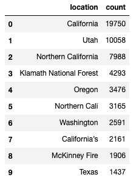
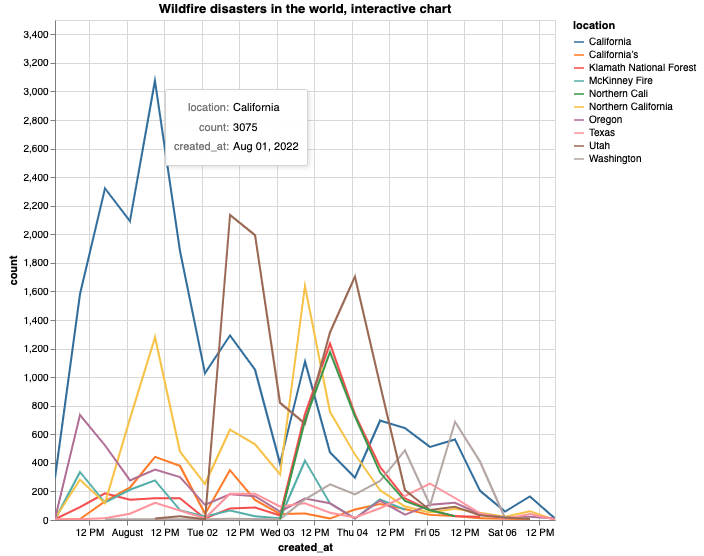
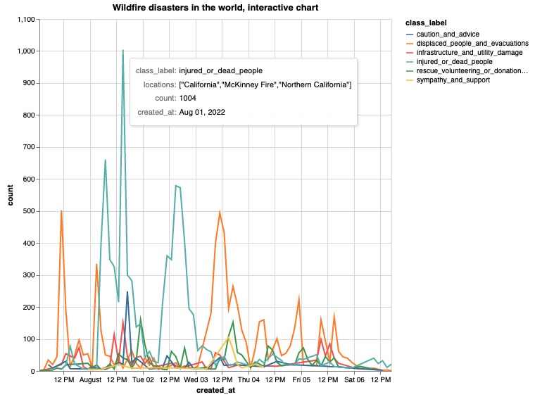
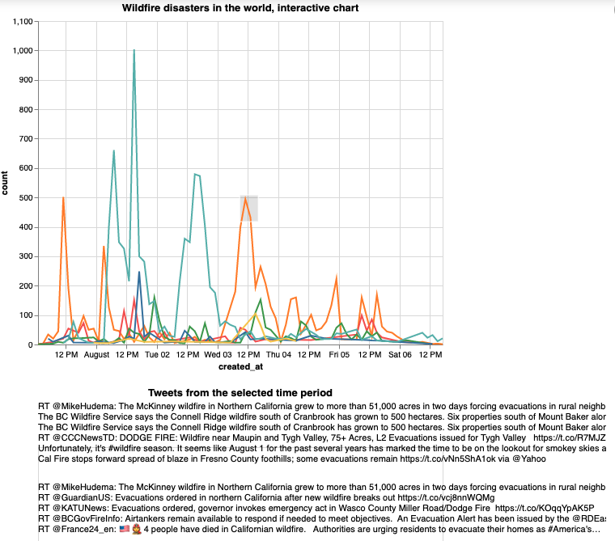
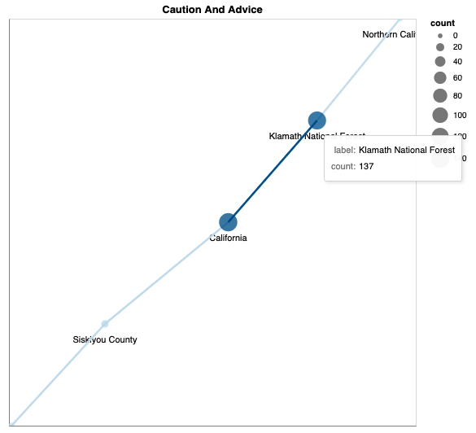
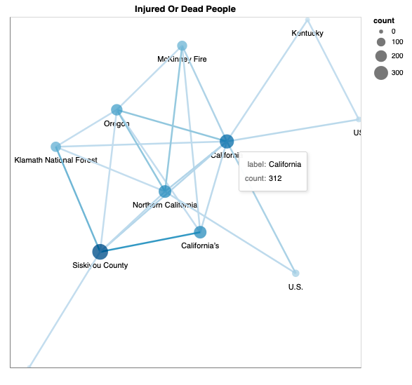
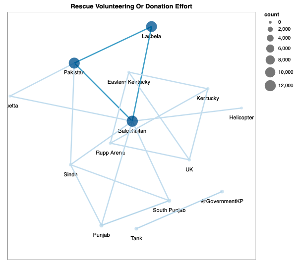

# Exploring the individual recent disaster tweets

## Overview
The comparative analysis section explained how the recent disaster tweets were queried and retrieved,
and then processed for finding a dominant disaster type per class. The following section continues the 
exploration with doing a location extraction and interpretation, also shows creative ways for
sampling and visualizing tweets based on a selected criteria. The exploration is using [Altair](https://altair-viz.github.io/) 
library, which provides interactive features, however, the charts are not visible directly in GitHub.
For that reason, the produced Jupyter notebooks are exported as PDF files in folder docs/pdfs. Of course,
you can run the project yourself and play with the generated interactive artifacts.

Some questions where the focus on this elaboration is are as follows:
- What are the affected locations, are some locations connected together?
- What is the disaster intensity over time, what are the peak days?
- Can we preview the tweets for a particular time and understand better what is going on?

## Tweet location extraction
For the purposes of disaster analysis, the locations are extracted from the tweet text and not
from the associated metadata attributes, and the rational for that is that a relevant tweet is
not necessarily posted at the disaster location.

We are using [spaCy](https://spacy.io/) library with the xx_ent_wiki_sm pipeline, which is good for
finding out locations in text.

Once the extraction process completed, a new column is added to the recent tweet data that contains
a list of all locations extracted from the tweet. Therefore, there may be two or more locations in
the same text:

The top locations by tweet count are then identified and ready to be used. For the "wildfire" 
disaster type for example, for the period between July 31st, 2022 and August 7th, 2022, the top
fire locations are:

## Disaster tweets interactive exploration

The first thing is to do with the updated data is to create an interactive chart that to show us
what are the affected locations over time. As expected, California is pretty active, with wildfire
tweets mentioning heavily also Utah (with brown line):

Running the classification models assigns a class label on each tweet in the dataset. The respective
interactive visualization now shows what class and locations are affected at a particular time,
and allows us to explore the peaks:

A subsequent interactive visualization allows us to quickly sample the tweets for a selected period
and get even better idea and details on what is going on with the particular disaster at that time:

The fact that we collect multiple locations from a tweet allows us to do further exploration and see
what locations are used together. This allows us to quickly understand and narrow down some less
known locations - i.e. in the following interactive chart for the class "Caution And Advice", we can
see that the primary location is California and Northern California. However, the exact location of
the fire is Klamath National Forest:

The class "Injured or dead people" interactive location network visualization is even more interesting,
because is shows more connections - we can see that the fires in California are most probably
affecting also the neighbour state of Oregon, that Klamath National Forest is in California, but also
in the Siskiyou County in northern California etc:

The next visualization shows two completely different locations related to two separate flood
disasters - one is in the state of Kentucky, the other one is in Pakistan - we can see that two 
separate networks are getting formed, and we can explore each one of them. We also can see that 
the location extraction is not perfect - i.e. we have the work "Helicopter" as a location, most probably
because in the tweet is starts with a capital letter:

The exploration also allows us to randomly sample tweets for multiple overlapping locations and understand
better how are they connected.

## Final observations and conclusions

Interactive visualization can be a powerful tool to provide a deeper understanding of the natural
disasters in the world that are going on at a particular time, provide an insight about the affected
locations and how are they related and grouped, and also sample the tweets content and get the exact
details of what they try to communicate. 