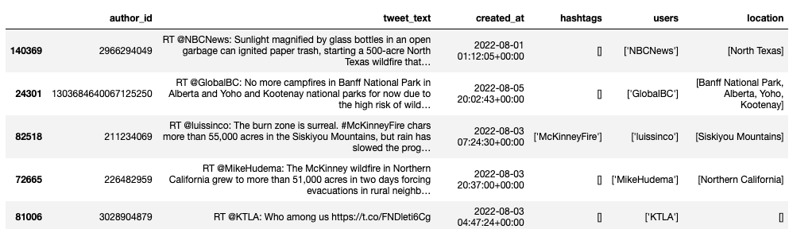

# Exploring the individual recent disaster tweets

## Summary
The comparative analysis section explained how the recent disaster tweets were queried and retrieved,
and then processed for finding a dominant disaster type per class. The following section continues the 
exploration with doing a location extraction and interpretation, also shows creative ways for
sampling and visualizing tweets based on a selected criteria. The exploration is using [Altair](https://altair-viz.github.io/) 
library, which provides interactive features, however, the charts are not visible directly in GitHub.
For that reason, the produced Jupyter notebooks are exported as PDF files in folder docs/pdfs. Of course,
you can run the project yourself and play with the generated interactive artifacts.

Some questions where the focus on this elaboration is are as follows:
- What are the affected locations, are some locations connected together?
- What is the disaster intensity over time, what are the peak days?
- Can we preview the tweets for a particular time and understand better what is going on?

## Tweet location extraction
For the purposes of disaster analysis, the locations are extracted from the tweet text and not
from the associated metadata attributes, and the rational for that is that a relevant tweet is
not necessarily posted at the disaster location.

We are using [spaCy](https://spacy.io/) library with the xx_ent_wiki_sm pipeline, which is good for
finding out locations in text.

Once the extraction process completed, a new column is added to the recent tweet data that contains
a list of all locations extracted from the tweet. Therefore, there may be two or more locations in
the same text.

